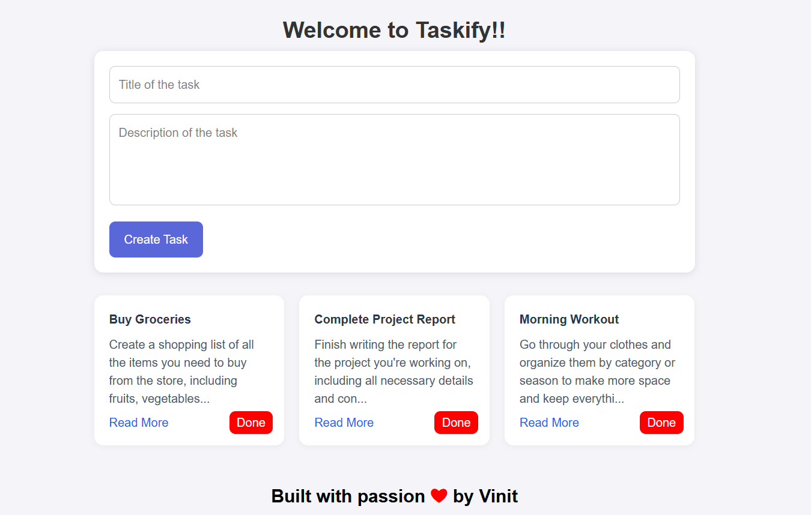
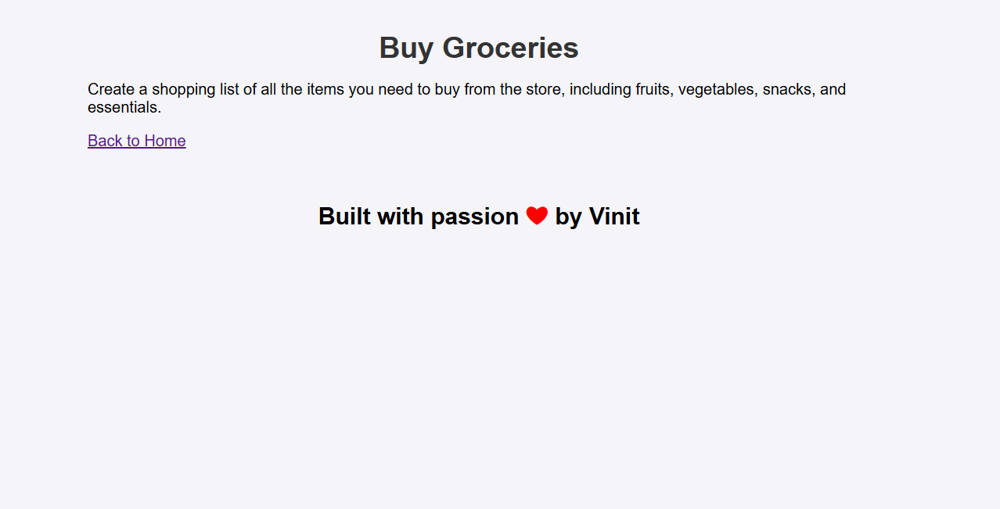

# 🚀 Taskify – Your Mini Task Buddy

Say hello to **Taskify**, a lightweight and no-fuss task-keeping web app built with **Node.js**, **Express**, and **EJS**. Whether you're planning world domination or just trying to remember your groceries – Taskify's got your back (temporarily 😉)!

---

## 🖼️ Sneak Peek




---

## 🛠️ Built With

- 🟩 Node.js
- ⚡ Express.js
- 🎨 EJS (Embedded JavaScript)
- 💅 Vanilla HTML & CSS

---

## ✨ Features

- 📝 Add your tasks with ease
- 🔄 Instant updates (well... until you refresh 😅)
- 🎯 Clean & minimal design
- ⚡ Super lightweight – runs in a flash

> **Note:** This version doesn’t store your tasks forever. Think of it like a whiteboard — once wiped, it's gone!

---

## 🚀 Getting Started

Clone it, run it, love it:

```bash
# Clone the repository
git clone https://github.com/your-username/taskify.git

# Move into the directory
cd taskify

# Install dependencies
npm install

# Start the app
node index.js
# or if you have nodemon
nodemon index.js
